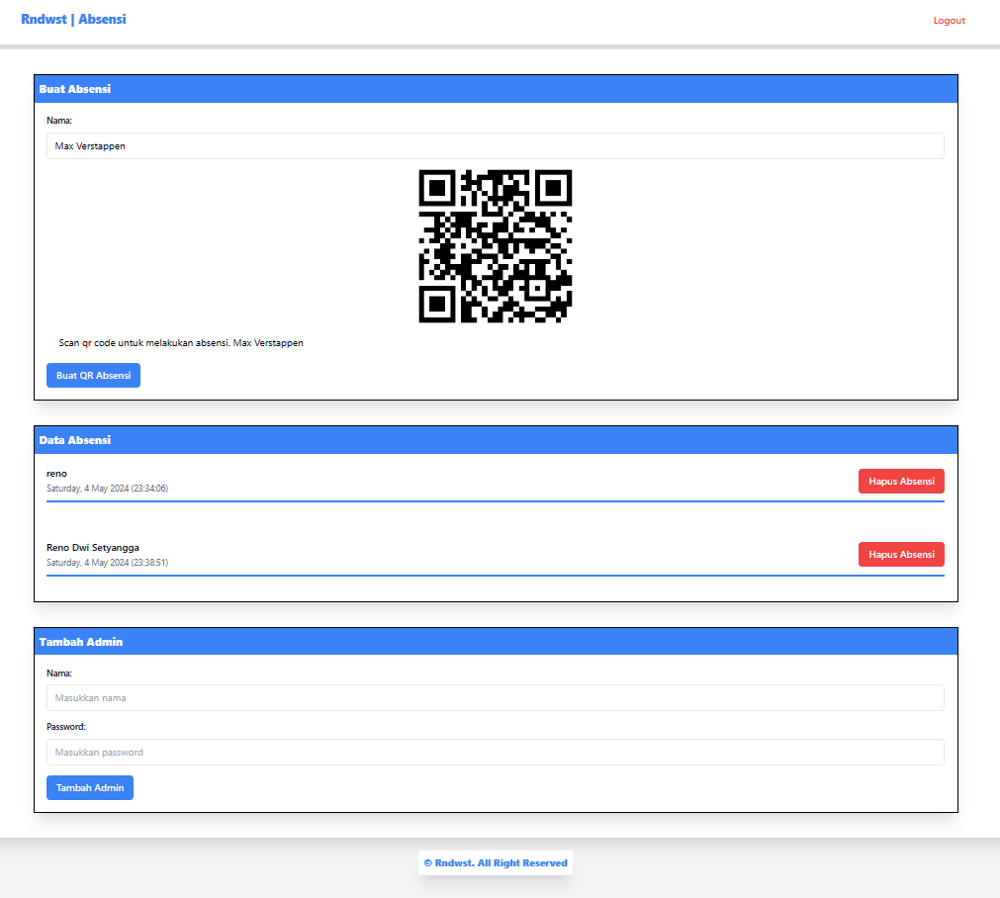

# Absensi Menggunakan Web dan QR

Halo dunia, kali ini gua bikin sistem absensi pakai html, css (tailwind), javascript, php, sama mysql buat sistemnya. Cara pakainya operator tinggal login terus masukkan nama yang akan ditambahkan kedalam boks "Buat Absensi" kemudian perintah seseorang untuk mengscan qr yang telah digenerate.

## Karena ini dibuat hanya untuk percobaan maka tailwind hanya dikoneksikan melalui cdn, jika kamu ingin menggunakannya untuk banyak orang gunakan tailwind sesuai dengan ketentuan tailwind agar tidak berat!

## Sebelum menggunakan tolong untuk mengubah konfigurasi database dan domain pada config.php! 

## Preview
